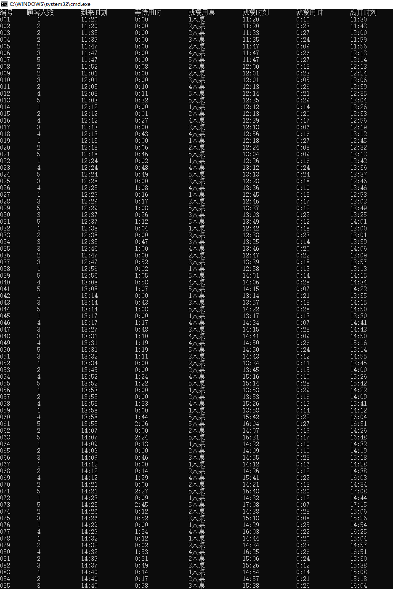
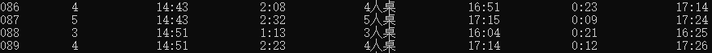
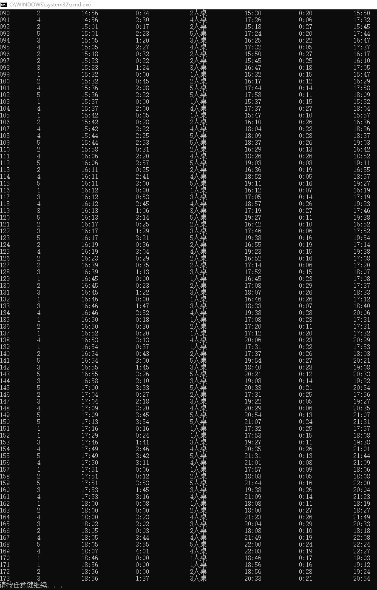

## 设计目标

此程序意在实现一种顾客排位与桌位安排系统，模拟实际生活过程中的排队软件。

### 问题细节

假设某饭店有`n1`个1人桌位、`n2`个2人桌位、......`ns`个s人桌位，每种桌位可接受不多于自身座位数的顾客数量。顾客按随机数量组队先后进入饭店，不同组顾客不能拼桌（比如当前只空余一个四人桌位，有两组分别为三人和一人的顾客在等位，那么这两组顾客不能拼桌同时就餐，而只能让先到来的一组顾客使用四人桌位就餐）。每组顾客就餐结束后这个桌位就立即空余出来，可以安排给其它顾客使用。由于每个桌位在某个时刻只能接待一桌顾客，因此如果当前没有满足顾客数量的空余桌位时，顾客们需要按到来顺序排队，直到有可以容纳自己这组顾客数量的桌位空余出来。

### 实现目标

#### 编写程序实现以下功能：

1. 一天中所有组顾客在饭店的平均停留时间、平均等位时间。注：一组顾客的停留时间=等位时间+就餐时间；
2. 最后一组离开饭店的顾客的离开时间；
3. 将一天内所有组顾客的到达时刻、等位用时、就餐时刻、就餐用时、及离开时刻按格式输出（具体见输出要求），输出按照顾客编号排序。

#### 对餐厅及顾客数据进行如下模拟：

(1) 饭店从 11: 00 开始营业，顾客到达时间随机产生（如果产生了相同的随机时刻，按照各个组顾客人数从少到多排序号，输入文件中应确保不存在到达时刻和顾客人数均相同的顾客组），一天内到达顾客的组数不少于100 组。如果存在顾客离开时刻超出24: 00，计入第二天。

(2) 每组顾客按到达顺序有独一无二的编号，就餐用时随机产生且不超过半个小时，输出按照顾客到来时刻以及(1)中的规定确定编号排序；

(3) 饭店的桌位信息作为输入进行合理设定。

## 总体分析

根据题目要求，程序需要完成如下功能模块：

- I/O模块：实现数据读入以及结果制表输出
- 随机数据生成模块：实现顾客数据随机生成，包含每组顾客人数、到达时间、就餐用时
- 顾客桌位安排模块：程序主体模块，实现顾客等待时间、离开时间等项目计算
- 控制模块：实现顾客桌位安排模块正常工作，由main函数实现

## 概要设计

### I/O模块：

根据题目要求输入输出数据，采用c++输入输出流进行相关功能实现

### 随机数据生成模块：

产生不少于100组随机数，要求不存在到达时刻和顾客人数均相同的顾客组

- 随机选取不少于75个时间点，每个时间点随机生成1-3组顾客，每组顾客随机1-5人
- 通过从随机排序后的数组中选取来避免产生重复数字

### 顾客桌位安排模块：

此模块实现了两个类

- customer_queue：模拟顾客进店的过程
- table_queue：模拟顾客就坐吃饭以及离店过程

两个类中的顾客数据成员均为顾客节点指针，以便能够更新相应顾客状态

顾客节点定义：

```c++
class customer_node {
	friend class customer;
	friend class waiting_queue;
	friend class table_queue;

public:
	customer_node() :nums(0), arrive(0), sit(0), leave(0), table(0), use(0), table_number(0), have_eaten(false){}
	customer_node(int num, int arr, int time_use) :nums(num), arrive(arr), use(time_use), sit(0), leave(0), table(0), table_number(0), have_eaten(false) {}

	int arrive_time() const { return arrive; }
	int leave_time() const { return leave; }
	int customer_nums() const { return nums; }
private:
	int nums, arrive, sit, use, leave, table, table_number;
    //顾客人数/到达时间/就坐时间/就餐用时/离店时间/使用桌位/桌位编号
	bool have_eaten;
    //顾客是否已经就餐（为customer_queue的pop方法提供支持）
};
```


### customer_queue:

使用链表来模拟队列，customer类定义：

```c++
class customer {
public:
	typedef customer_node Node;
	typedef customer_node* NodePtr;

	customer();
	customer(std::istream& is);
	~customer();

	void put_all(std::ostream& os);			//制表输出
	double ave_stay();						//平均停留时间
	double ave_wait();						//平均等位时间

	//以下函数是模仿队列的操作行为
	NodePtr top();						//返回it指向节点的地址
	NodePtr fewer(int num);				//返回比指定人数更少一点的顾客组
	int top_time();						//返回it指向位置客人的到来时刻
	void pop();							//将it迭代器向后移动
	bool empty();						//判断it迭代器是否已经指向末尾
	void reset();						//将it重置到链表首位 == 清空模拟队列


private:
	std::list<NodePtr>::iterator it;
	std::list<NodePtr> cus;

	static bool compare(const NodePtr x, const NodePtr y);
	void time_out(std::ostream& os, int time);
};
```

#### 初始化：

一次性读入所有客人数据，存储在标准库链表`cus`中，按照进店时间完成排序，迭代器`it`指向表首元素

#### 模拟客人入店队列：

利用迭代器`it`来模拟队列的操作行为

##### 核心功能函数fewer，根据当前空闲桌位，返回符合要求的客人组，以便入桌就坐，客人组符合以下条件：

- 当前队列中到店时间最早
- 小于等于最大空闲桌位数（比如只空闲4人桌，只能返回4人组、3人组等，而不能返回5人组）

##### 核心功能函数pop

模拟队列的出队操作，但由于fewer函数并不严格从队首取得元素，所以进行了相关优化

```c++
void customer::pop(){
	while (it != cus.end() && (*it)->have_eaten) it++;	//当客人就坐时，have_eaten被置为true
}
```

#### 入店完成：

制表输出所有客人的相关数据

### table_queue:

模拟客人就坐以及就餐完成离开的过程，使用链表来模拟客人队列，使用数组来记录桌位使用情况

```c++
class table {
	friend class table_queue;
public:
	table() :total(0), occupied(0), chairs(0) {}
	table(int t, int c) :total(t), occupied(0), chairs(c) {}

	bool full() { return total == occupied; }

	int operator--(int);
	int operator++(int);

private:
	int total, chairs, occupied;
//该类桌子总数 / 该类桌子最大容纳数（几人桌） / 当前已使用几张这样的桌子
};

class table_queue {
public:
	typedef customer_node Node;
	typedef customer_node* NodePtr;

	table_queue() {}
	table_queue(std::istream& is);

	//以下函数是模仿队列的操作行为
	int top_time();						//返回队首指向位置客人的离开时刻
	void pop();							//删除表头元素
	bool empty();						//判断是否还有顾客
	bool full();						//判断是否所有桌子都已坐满
	bool push(NodePtr c, int time);		//客人进入，并计算leave时间戳,若桌子已满，不会进入并返回false
	int max_empty_table();				//返回当前最大空闲桌位

private:
	std::list<NodePtr> cu;
	std::vector<table> t;				//存储table节点，记录所有可用桌位的状态

	int find_table(NodePtr c);			//根据人数，寻找符合条件的餐桌编号，找不到返回-1
};
```

#### 初始化：

读入所有可用桌子，初始化它们的状态

#### 模拟客人入桌队列：

##### 核心函数push：

客人就坐，根据外部计时器提供时间，写入客人就坐时间（此项为客人等待时间计算依据），更新桌子状态，更新客人have_eaten状态

##### 辅助函数find_table：

根据进店客人人数，找到符合要求的桌子编号（进店3人，可用3人桌、4人桌、5人桌，返回最小人桌桌位编号）

### 控制模块：

- 调用I/O

- 实现顾客桌位安排模块正常工作


需要注意的是，此程序中的所有时间实际存储的都是从0开始的时间，且仅仅储存分钟数（如65分钟521分钟），不产生进位，只有在格式化输出的时候才会调整为11:00开始的，按常用时间格式的方式输出（如13 : 24）。这样保证了程序内部时间比较的方便性。

## 详细设计

具体可参考源代码文件

## 调试分析

### 测试数据

#### 顾客数据

采用随机生成，为了避免顾客人数过多而导致离店时间晚于次日凌晨2时，我们产生大约150组数据，每组顾客随机1-5人，每个时间点会随机有1-3个顾客，不会有同一时间点同样人数的顾客产生，具体实现方法可参看rand_data.cpp

#### 桌位数据

采用如下桌位输入

| 桌椅数（几人桌） | 桌位数（几张这样的桌子） |
| ---------------- | ------------------------ |
| 1                | 2                        |
| 2                | 2                        |
| 3                | 1                        |
| 4                | 1                        |
| 5                | 1                        |

大桌子较少，这样保证了能有一些顾客会等待一段时间，以测试程序的正确性

### 测试结果







### 时间复杂度分析

#### 随机数据产生

随机产生所有数据，时间复杂度为`O(n)`

#### 客人排位

以时间为基准，每次让一组客人进店或者让一个吃完的顾客出店，这是一个线性的过程，时间复杂度为`O(n)`。

但在每次让一组客人进店时，由于需要在客人队列中向后遍历搜寻一个合适的客人组（可能当前队首的客人先到，但由于该组客人人数过多没有符合要求的桌子，而需要向后搜寻人数较少时间较前的客人组），这在最坏情况下也需要线性时间，所以时间复杂度能达到O(n^2^)。

但由于向后搜寻几乎不会每次都搜寻很多组客人（大约只需要向后搜寻几组就可以找到符合要求的了），所以很难出现平方级现象，平均性能以及大多数情况都能够稳定在`O(n)`上。

### 调试问题分析与解决

本程序的基本思路还是较为简单的，所以在调试中并没有出现较大问题，唯一的问题就是刚刚提到的问题（可能当前队首的客人先到，但由于该组客人人数过多没有符合要求的桌子，而需要向后搜寻人数较少时间较前的客人组）

解决这一问题的核心函数就是

```c++
customer::NodePtr customer::fewer(int num)
{
	list<NodePtr>::iterator current = it;
    //当前不是队尾且当前顾客组人数过多或者当前顾客组已就餐，便继续向后遍历
	while (current != cus.end() && ((*current)->nums > num || (*current)->have_eaten)) current++;
	if (current == cus.end()) return NULL;
	return *current;
}
```

其中`num`是当前最大的空闲桌，这个函数能够找一个组能够符合当前空闲桌位的最前客人组，可能相等，也可能顾客人数小于桌位数，这也是前文时间复杂度分析中可能导致平方级的来源。

### 算法改进

#### 空间复杂度改进

此设计思路应该还可以优化，将客人等待队列和桌位就餐顾客队列合并成一个队列，这样能够节省大约一半的空间，但这里涉及到一些操作上的困难（若数据放在一个链表上，这两个队列会有一定的交叉）程序较难管理。

#### 时间复杂度改进

线性已经是最优的时间复杂度了，再想改进的话，需要解决`customer::fewer(int num)`函数可能带来的平方级开销问题，这一问题暂时还没有较好的解决思路。

## 参考资料

https://www.cnblogs.com/salan668/p/3652532.html 产生不重复的随机数